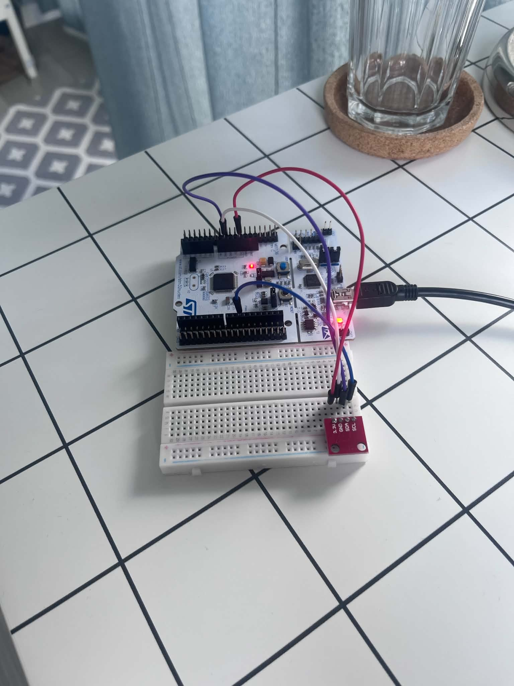
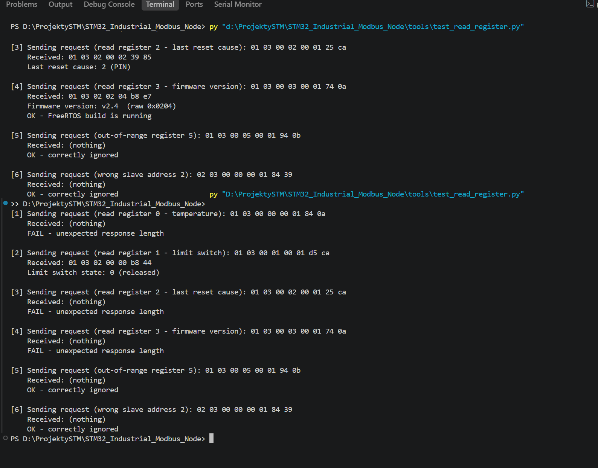
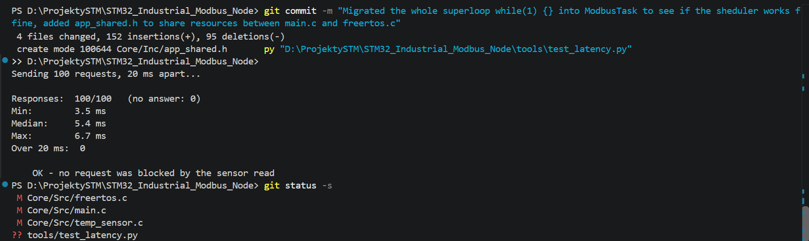

# STM32_Industrial_Modbus_Node

Głównym celem w tym projekcie było napisanie od podstaw urządzenia wykorzystującego protokół komunikacyjny Modbus, obejmujący wykrywanie ramek, sumy kontrolne CRC oraz mapę rejestrów. Był to dla mnie skuteczny sposób na zrozumienie zasad działania tego protokołu. Miałem już wcześniej doświadczenie z układami STM32, jednak jest to mój pierwszy projekt zrealizowany pod kątem wykorzystania przemysłowego. Przy okazji rozwinąłem również umiejętności związane z systemem FreeRTOS. Poniżej zamieściłem zdjęcie projektu zmontowanego i testowanego na płytce stykowej.

My primary goal for this project was to write a Modbus RTU stack from scratch including frame detection, CRC checksums, the register map. For me it was the best way to learn how this protocol works. I had worked with STM32 before, but this is my first project written to industry conventions rather than just to get something running. I also improved my skills in implementing FreeRTOS in the STM32 projects. Below, i added w photo of the project assembled on a breadboard.




## Overview

A small industrial I/O node on an STM32F446RE. It acts as a **Modbus RTU slave**: a master polls it over a serial line and reads back the temperature from an HTU21D sensor, the state of a limit switch, and a set of diagnostic registers. Frames are detected in hardware with DMA plus a timer measuring the 3.5-character silence the protocol requires, and every frame is CRC-checked before anything acts on it.
It was first written **bare-metal on a superloop**, tagged as a working version, and only then migrated to **FreeRTOS** — not for the sake of it, but to fix a measurable problem the superloop had.

The node is meant to sit on an **RS-485** bus eventually. The protocol side is finished; the transceiver is not fitted yet, so for now the master talks to it over the ST-Link virtual COM port.


---

## How the project came together

One subsystem per branch, each merged into `main` once it worked on hardware.

**1. UART** — CubeMX setup, then the Modbus frame receiver: circular DMA into a buffer, TIM1 measuring inter-frame silence, and CRC16 validation. Verified with a Python script that sends a valid frame and a deliberately corrupted one.

**2. MODBUS** — parsing address, function code and register number, then building a real response instead of echoing bytes back. Function `0x03` (Read Holding Registers) only.

**3. HTU21D** — I2C driver for the sensor, temperature scaled ×10 into register 0. Two things cost time here: the sensor needs pull-ups my breakout board does not have (enabled internally in the end), and the first version ignored the HAL return codes, so a disconnected sensor produced a confident-looking 111.7 °C instead of an error.

**4. CYLINDER_LIMIT_SWITCH** — EXTI interrupt on both edges, state mirrored into register 1. Both edges, not just the falling one, because the register has to report the *current* state, not count presses.

**5. BUGS** — the reliability layer: independent watchdog, the `INIT / NORMAL / FAULT` state machine, and reset-cause logging to Flash. Tagged **`v1.0-baremetal`** at the end of this stage.

**6. RTOS** — migration to FreeRTOS in five steps, each one built, flashed and tested before the next: whole superloop into one task → split off `SensorTask` → semaphore instead of polling → `DiagnosticTask` with health flags → append-only reset log.

---

## Toolchain

- **STM32CubeMX 6.17** for peripheral configuration, **STM32CubeCLT 1.21** for the build
- CMake + Ninja, `arm-none-eabi-gcc`
- **FreeRTOS** via CMSIS-RTOS v2, `heap_4`, 8 kB heap

```powershell
& "C:\ST\STM32CubeCLT_1.21.0\Ninja\bin\ninja.exe" -C build\Debug
& "C:\ST\STM32CubeCLT_1.21.0\STM32CubeProgrammer\bin\STM32_Programmer_CLI.exe" `
    -c port=SWD mode=UR -w "build\Debug\STM32_Industrial_Modbus_Node.elf" -v -rst
```

`mode=UR` (connect under reset) is not optional once the watchdog is enabled. Without it the programmer has to catch the MCU between resets, and a firmware that reboots every few seconds is very good at not being caught.

Current footprint: **14.2 kB RAM (10.8%)** and **39.7 kB flash (7.6%)**. The bare-metal version used 2.5 kB and 25.0 kB — so FreeRTOS costs about **11.7 kB of RAM and 14.6 kB of flash**, most of the RAM being the 8 kB heap.

> Two things will waste your time here.
>
> **CubeMX overwrites `cmake/stm32cubemx/CMakeLists.txt` on every "Generate Code".** Hand-written source files listed there silently disappear and come back as `undefined reference`. They belong in the **root** `CMakeLists.txt`, under `target_sources(...)` — that file is generated once and never touched again.
>
> **Anything outside a `USER CODE BEGIN/END` block is deleted on regeneration.** `__HAL_DBGMCU_FREEZE_IWDG()` vanished three times before it ended up inside `USER CODE BEGIN Init`.

---

## Hardware & pinout

**Board:** NUCLEO-F446RE. System clock 84 MHz from the internal HSI through the PLL — no external crystal is fitted on this board, and HSI is accurate enough for UART.

| Function | Pin | Notes |
| --- | --- | --- |
| USART2 TX / RX | PA2 / PA3 | 115200 8N1, via the ST-Link virtual COM port |
| I2C1 SCL / SDA | PB6 / PB7 | HTU21D at `0x40`, 100 kHz, internal pull-ups |
| Limit switch | PC13 | EXTI, both edges, active low |
| Activity LED | PA5 | toggles on every valid frame answered |

`mode=UR` aside, the ST-Link does double duty: SWD for programming and the virtual COM port the master talks over. In a real installation the UART would go to an RS485 transceiver instead — the protocol code would not change, only the physical layer and one GPIO for the driver-enable line.

---

## Modbus register map

Slave address **1**, function **`0x03`** (Read Holding Registers), one register per request.

| Register | Meaning | Format |
| --- | --- | --- |
| 0 | Temperature | ×10, so `253` = 25.3 °C. `65535` means the I2C read failed |
| 1 | Limit switch | `0` released, `1` pressed |
| 2 | Last reset cause | see the list below |
| 3 | Firmware version | high byte major, low byte minor — `0x0200` = v2.0 |
| 4 | Reset count | entries in the Flash log since the last sector erase |

Reset causes: `0` unknown, `1` power-on, `2` reset pin, `3` independent watchdog, `4` window watchdog, `5` software, `6` brown-out.

Requests for a register outside this range, for a different slave address, with a bad CRC, or for an unsupported function code get **no answer at all** — which is what the Modbus specification asks for, and also what the fail-safe state does deliberately.



---

## Architecture

Three tasks, sized by what they actually need:

| Task | Priority | Stack | Job |
| --- | --- | --- | --- |
| `ModbusTask` | High | 512 words | Waits on a semaphore, validates and answers one frame |
| `SensorTask` | Normal | 512 words | Reads the HTU21D once a second, sets `NORMAL` or `FAULT` |
| `DiagnosticTask` | BelowNormal | 256 words | Feeds the watchdog, but only when every task reported in |

`ModbusTask` runs highest because it is the only one with an externally imposed deadline — a master that does not get an answer in time declares the node dead. Everything else can wait.

```
   TIM1 ISR (3.5-character silence detected)
         | osSemaphoreRelease
         v
   ModbusTask --reads--> holding_registers_map <--writes-- SensorTask (reg 0)
                                  ^
                                  +--writes-- EXTI ISR (reg 1)

   ModbusTask --+
   SensorTask --+--> task_alive_flags --> DiagnosticTask --> HAL_IWDG_Refresh
   DiagTask ----+
```

**There is no mutex on the register map, on purpose.** Aligned 16-bit accesses are atomic on a Cortex-M4, only single registers are ever read, and a mutex cannot be taken from an ISR anyway — and one of the writers *is* an ISR. That changes the day a request may span several registers and needs a consistent snapshot.

`ModbusTask` waits with a **500 ms timeout** rather than forever. Not because a frame might be missed, but because a task that never wakes can never report itself alive, and the watchdog would then reset a perfectly healthy device during a quiet spell on the bus.

---

## Why FreeRTOS

For a node this simple, bare-metal is a defensible choice, and plenty of commercial Modbus I/O modules ship exactly like that. The frame timing that actually matters is handled by a timer and DMA, not by a scheduler.

The superloop had one concrete flaw, though. `read_htu21d_temperature()` blocks for about 50 ms in normal operation and up to ~250 ms when the sensor stops answering. In a superloop that stalls **everything**, so a request arriving during a sensor read waits for it to finish. Masters typically time out somewhere between 200 ms and 1 s, which put the device uncomfortably close to being declared dead by a sensor problem that had nothing to do with the bus.

Splitting the sensor into its own task fixes that: the blocking call now blocks only that task, and `ModbusTask` preempts it.

Measured with `tools/test_latency.py` — 100 requests, 20 ms apart, so a few of them are bound to land inside a sensor read:

| | min | median | max | over 20 ms |
| --- | --- | --- | --- | --- |
| after splitting `SensorTask` | 3.5 ms | 5.4 ms | 6.7 ms | 0 / 100 |
| after replacing polling with a semaphore | 3.6 ms | 4.7 ms | 6.5 ms | 0 / 100 |



The ~5 ms floor is not the scheduler — it is the 1.75 ms silence detection plus the USB-serial round trip. The scheduler's contribution is the part that disappeared: the median dropped by the ~1 ms of `osDelay(1)` polling granularity once the task started sleeping on a semaphore instead.

---

## Reliability

**Fail-safe.** A failed sensor read puts the node into `FAULT`, and in that state it answers **nothing** — not even registers unrelated to the sensor. Stale data presented as current is worse than silence. Recovery is automatic: one successful read returns it to `NORMAL`, no reset involved.

**Watchdog with health flags.** The independent watchdog (~4.1 s) is refreshed by `DiagnosticTask`, and only when all three tasks have set their bit since the last check. Refreshing it from a single task would only prove *that* task is alive. Verified by disabling one task's report and watching the node reset itself, with register 2 reading `3 (WATCHDOG_IWDG)` afterwards.

**Reset log.** The cause is read from `RCC_CSR` before anything else runs and appended to Flash sector 7. It started as a single byte rewritten on every boot, which meant erasing a 128 kB sector — a 1–2 s freeze at every start, and ~10 000 resets before wearing the sector out. It is now an append-only log: an erased byte reads `0xFF`, so the first `0xFF` marks both the next free slot and the number of entries so far. The sector is erased once every 1024 resets instead, which is roughly a **thousandfold** improvement in endurance and removes the startup freeze entirely.

---

## Test workflow

Four scripts in `tools/`, all `pyserial`, all expecting `PORT` to be set at the top.

| Script | What it checks |
| --- | --- |
| `test_crc_frame.py` | A valid frame is answered, a corrupted one is silently dropped |
| `test_read_register.py` | All five registers, plus out-of-range and wrong-address requests |
| `test_latency.py` | Round-trip time over 100 requests — proves the sensor is not blocking the bus |
| `watch_reset_cause.py` | Polls register 2 for 20 s; used when the device is resetting and single runs keep landing in the dead window |

Two failure injections worth repeating after any change:

- **Unplug SDA.** Within ~1.3 s the node goes silent on every register. Plug it back in and it answers again on its own. Register 4 must not have moved — no reset happened, the fault was handled without one.
- **Comment out one task's `task_alive_flags |= ...`.** The node should reset itself after ~4 s and report `3 (WATCHDOG_IWDG)` in register 2.

---

## Known limitations

- **Function `0x03` only**, one register per request. No writes, no multi-register reads.
- **No RS485 transceiver yet.** The protocol is finished, the physical layer is not — that also needs a GPIO driving the transceiver's DE/RE line.
- **The Flash reset log stores 1024 entries but only the newest is exposed** over Modbus. The history is there; nothing reads it out yet.
- **Blocking I2C.** `HAL_I2C_Master_Transmit/Receive` busy-wait until their timeout. It no longer affects Modbus responsiveness, but it does burn CPU that interrupt- or DMA-driven I2C would give back.
